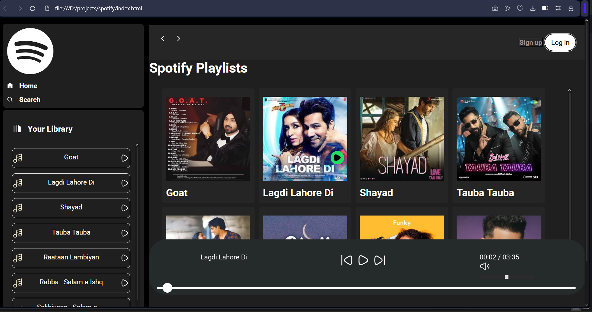

# Spotify-Clone-UI-UX-Design
# 🎵 Spotify Clone - UI/UX Design

A responsive front-end **Spotify Web Player UI Clone** built using **HTML**, **CSS**, and **JavaScript**. This project replicates Spotify's sleek dark interface with interactive elements and modern design.

---

## 🔧 Technologies Used

- HTML5  
- CSS3 (Flexbox, Grid, Media Queries)  
- JavaScript (Vanilla)  
- SVG Icons  
- Utility Classes (`utility.css`)

---

## 🚀 How to Run

1. Clone the repository  
   `git clone https://github.com/your-username/Spotify-Clone-UI-UX-Design.git`

2. Open `index.html` in your browser

---

## 📸 Preview

  

---

## 📌 Features

- Dark-themed Spotify-style UI  
- Interactive play/pause and volume controls  
- Responsive sidebar and playlist layout  
- Smooth transitions and modern UX

---

## 🪄 Future Improvements

- Add real music playback  
- Spotify API integration  
- Playlist storage

---

